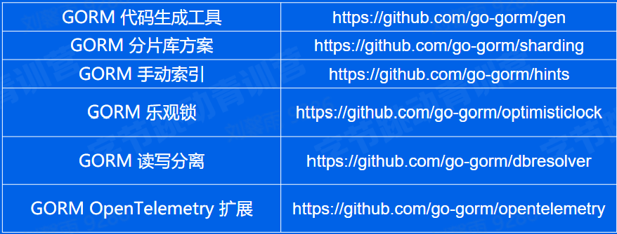
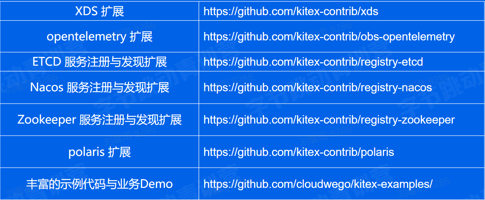
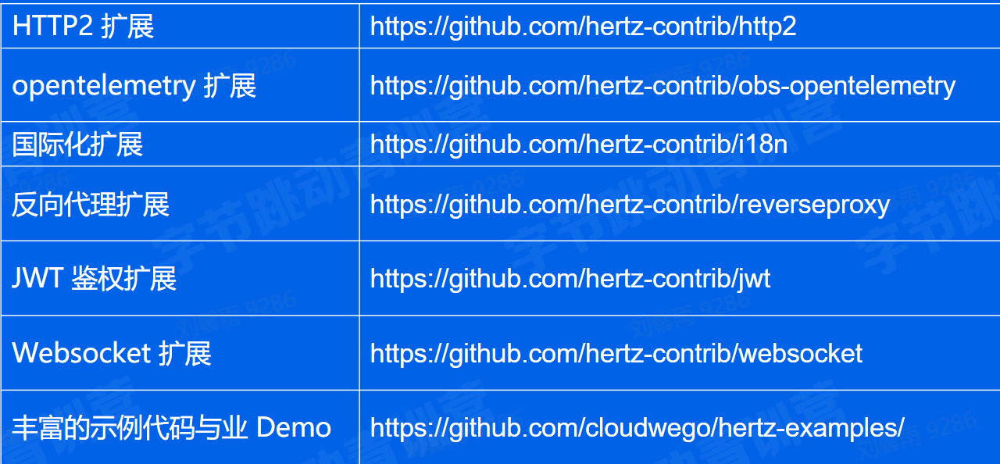
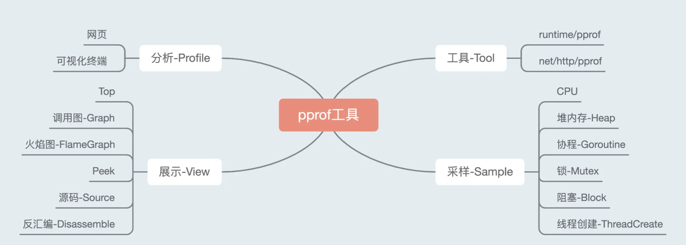
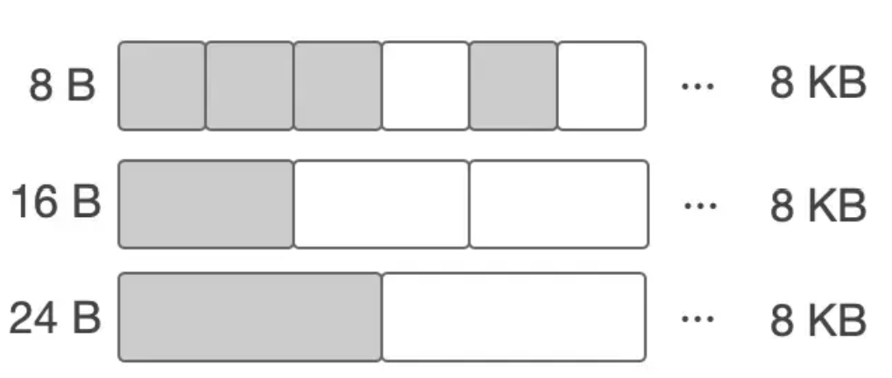
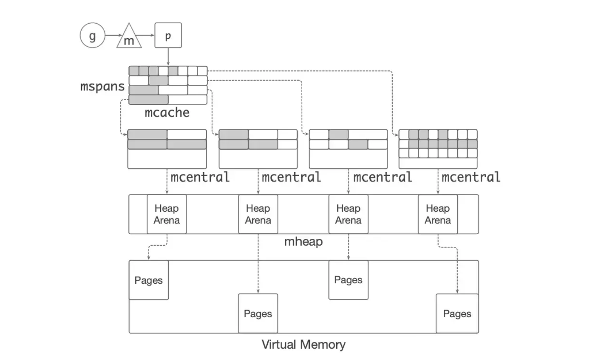

## 字节青训营听课笔记 Part1

### Day1 Go 语言基础 - 基础语法

**语法补充** 

- switch 后面可以什么都不跟，在case后面加条件

- 格式化输出：%v %+v %#v

- json用法：可以在变量后面指定`json:"age"`

**实战** 

- 在线词典-抓包

学习用go发送http请求，学习json解析

[彩云翻译](https://fanyi.caiyunapp.com/) 

进入彩云翻译后，翻译一个单词，右键按检查，在network中找到一个POST请求，再右键->copy->copy as curl

[代码生成](https://curlconverter.com/go/) 

利用上面复制的请求可以自动转化为go代码。在go代码中，首先创建一个http的客户，然后新建一个POST请求，给出url和要post的data，data应该是一个流，所以用strings的NewReader将string转化为流（减小内存占用）。接着设置一系列检查头，然后发送请求并获得resp，检查err后，需要首先defer关闭resp.Body，因为返回的Body也是一个流，需要关闭。然后用ioutil.Readall读取所有的响应体

上面实现的是一个硬编码，我们最后需要实现可以输入一个单词，所以在这里定义一个结构体，在用json.Marshal将其序列化，生成的是byte数组，后面用bytes.NewReader转化为流，然后一样的操作。

接着需要解析得到的resp，用json反序列化，一般反序列化需要有对应的结构体，这个结构体过于复杂，可以使用下面的工具辅助生成go结构体

[json变为go结构体](https://oktools.net/json2go) 

建议在获得响应后，先判断状态码是否正确，然后再反序列化，防止出现问题

- SOCKS5代理服务器

协商阶段（可能要认证，这里跳过）-> 请求阶段 -> 连接阶段 -> relay阶段

首先建立一个简单的server看是否可以正常连接：用net.Listen函数监听指定协议的指定端口，然后等待客户端请求，如果受到了请求，开一个新的线程并发处理请求。在请求中，第一步先defer 关闭请求，然后创建一个带缓冲的读取流，在后面将一个一个字节读取，事实上一个个读取效率很低，但是这里用了带缓冲的流，它会一次读取很多字节，返回一个。读取后通过write函数写入连接中发送到另一端。

如果成功，使用`nc 127.0.0.1 1080`可以建立一个tcp连接，然后实现echo

然后加入协商阶段，建立连接后首先调用auth函数，这个函数会读取客户发来的协商内容：版本号(1)，支持认证的方法数量(1)，对应的方法（一个方法一个字节），可以创建methodSize大小的切片，然后用io.ReadFull函数读满，然后返回给客户端：版本号(1)+认证方法(1)，这里给认证方法为0，即不需要认证

接着加入请求阶段，同样的按照协议的格式读取内容并验证，最后按照协议格式给出返回，注意读取多个字节，比如端口号时要用大端解析

最后加入连接阶段和relay阶段，连接阶段在获取到目标地址和端口后，使用net.Dial和目标建立tcp连接，defer关闭。relay阶段需要开启两个新的线程，在线程中利用io.Copy函数将从客户来的消息发送给目标地址，把目标地址的回复返回给客户。为了防止主线程直接退出，用context.WithCancel创建一个context，当某一方Copy失败时，会调用cancel，在主线程调用`<-ctx.Done()`等待某一方退出。

### Day2 Go 语言进阶 - 工程进阶

**并发编程** 

go中使用的是协程，它是在用户态实现的并发，一个线程可以有多个协程，通过go加函数使用

go通过通信共享内存，需要用到channel：
- 无缓冲通道，`make(chan int)`
- 有缓冲通道，`make(chan int , 2)`

<- chan 应该是会阻塞的

go里面也是可以通过不同协程修改同一个变量通信的，这个时候就需要用到锁来保证并发安全，`lock sync.Mutex`(读写锁)

WaitGroup：
```go
Add(delta int) //计数器加delta
Done() //计数器减1
Wait() //阻塞直至计数器为0
```

**依赖管理** 

gopath: 无法实现package多版本控制，新版本覆盖旧版本

go vender: 在项目下有一个vender目录，引入依赖副本，现在vendor找，找不见再去gopath，但是如果一个项目依赖的两个包分别依赖了另一个包的不同版本，又会出现问题

go module: 

依赖管理三要素：
- 配置文件描述依赖：go.mod
- 中心仓库管理依赖库：proxy
- 本地工具：go get/ mod 

go.mod语法：
- 首先指明了模块的路径，即在哪里可以找到这个模块，比如github地址（依赖管理的基本单元
- 然后标明了go的原生库的版本号
- 本单元依赖的包
    - 包的位置 版本号 其他
    - 版本号有两种形式
        - 语义化版本：vX1.X2.X3 （X1代表一个大版本，不同的X1之间可以是不兼容的，有一些大的修改，X2和X3不同要求是兼容的，X2是增加了一些函数功能，X3是一些代码的修改
        - 基于commit的伪版本：vX.0.0-时间戳-提交号
    - 版本号后面加`// indirect`，代表间接依赖
    - 在主版本大于等于2的模块位置后面会加上主版本号，如果该模块没有go.mod，就会在后面在版本号后面+incompatible

> 依赖某包的多个版本时，选择最低兼容版本

依赖分发：使用proxy，它是一个站点，缓存了第三方软件的模块，保证依赖的稳定性，通过GOPROXY环境变量配置proxy，可以包含多个服务站点，最后一个是源站

工具：
- go get：拉取模块缓存在本地
- go mod：管理模块
    - init 初始化
    - download 下载模块到本地缓存
    - tidy 整理依赖，增加需要的，去除不需要的

**测试** 

测试规则：
- 测试文件以`_test.go`结尾
- 测试函数的命名规范`func TestXxx(t *testing.T)`
- 初始化逻辑放在TestMain中
```go
func TestMain(m *testing.M) {
        // 测试前，数据装载，配置初始化等
        code := m.Run()
        // 测试后，释放资源等
        os.Exit(code)
}
```

测试运行命令：`go test [flags] [packages]`

测试过程示例：
```go
import (
        "github.com/stretchr/testify/assert"
        "testing"
)

func TestHelloTom(t *testing.T) {
        ouput := HelloTom()
        expectOutput := "Tom"
        assert.Equal(t, expectOutput, ouput)
}
```

单元测试覆盖率：在测试命令后面加上 --cover，将会输出测试的覆盖率，覆盖率代表测试涉及的代码量，比如某个测试只测试了if语句为true的情况，为false的情况就没有被覆盖

测试依赖：单元测试要求幂等和稳定，由于一些函数可能调用了一些FILE、DB、Cache，有可能不稳定，依赖网络情况，这个时候需要用到Mock技术（打桩

Mock可以为一个函数或方法打桩，即用一个更稳定的产生差不多效果的函数去替代这个方法，常用的Mock有[monkey](https://github.com/bouk/monkey) ，具体实例如下：
```go
func TestProcessFirstLineWithMock(t *testing.T) {
        monkey.Patch(ReadFirstLine, func() string {
                return "line110"
        })  //模拟读入文件的第一行为"line110"
        defer monkey.Unpatch(ReadFirstLine)
        line := ProcessFirstLine()
        assert.Equal(t, "line000", line)
}
```

基准测试：`func BenchmarkXxx(b *testing.B)`，用`b.ResetTimer()`重置时间，刨去不属于测试的初始化耗时，测试使用命令`go test -bench=package名`
```go
for i := 0; i < b.N; i++ {
        //运行的函数
}

//并行运行
b.RunParallel(func(pb *testing.PB) {
        for pb.Next() {
                //运行的函数
        }
})
```

**项目实践** 

这里有用到`sync.Once`，适用于高并发场景下只执行一次的场景（单例模式），减少存储浪费。

参数校验->准备数据->组装实体

`curl --location --request GET "http://0.0.0.0:8080/community/page/get/1"`

### Day3 Go 框架三件套详解(Web/RPC/ORM)

**ORM 框架 Gorm**

[gorm文档](https://gorm.cn) 

gorm 基础：
```go
package main

import (
	"errors"
	"fmt"

	"gorm.io/driver/mysql" //引入mysql的驱动
	"gorm.io/gorm"         //gorm包
	"gorm.io/gorm/clause"
)

//注意表要自己先建好，以及mysql的列名不区分大小写
//定义gorm module，这个结构就是数据库的一张表，字段为表的列
//默认约定ID字段为主键
type Product struct {
    ID uint `gorm:"primarykey;autoincrement"` //定义gorm tag
    Code string `gorm:"column:code"` //不要有空格
    Price uint `gorm:"default:100"`
    //Deleted gorm.DeletedAt //用于软删除，暂时不知道在数据库中怎么与之对应
}

// 为表定义表名
func (p Product) TableName() string {
    return "product"
}

// gorm hook，类似触发器，并且会默认将hook语句和执行语句放在一个事务中
func (p *Product) BeforeCreate(tx *gorm.DB) (err error){
    if p.Price < 0 {
        return errors.New("invalid price")
    }
    return
}

func (p *Product) AfterCreate(tx *gorm.DB) (err error){
    //比如为新商品在另一张表创建数量的条目
    return
}

func main() {
    db, err := gorm.Open(
        mysql.Open("root:@tcp(127.0.0.1:3306)/testdb?charset=utf8mb4&parseTime=True&loc=Local"), // 提供mysql的驱动，提供dsn即可，mysql的dsn格式见示例
        &gorm.Config{
            //更多提高性能的方法见：https://gorm.cn/zh_CN/docs/performance.html
            SkipDefaultTransaction: true, // 默认会为写操作创建事务，关闭后提高性能，但是hook也不再在事务中
            PrepareStmt: true, // 缓存预编译语句，可以提高效率
        }, //可以提供某些资源设置
    )
    if err != nil {
        panic("fail to connect database")
    }

    // 插入数据
    res := db.Create(&Product{Code: "A11", Price: 100}) //插入一条数据
    fmt.Println(res.Error) //输出可能的错误
    products := []*Product{{Code: "B11"}, {Code: "C11"}, {Code: "D11"}} //插入多条数据
    res = db.Create(products)
    p := &Product{Code: "E11", Price: 300}
    db.Clauses(clause.OnConflict{DoNothing: true}).Create(p) //处理冲突，避免插入冲突的数据

    // 查询数据
    var product Product
    // first只能查询单条记录，按主键升序，如果查不到返回ErrRecordNotFound
    db.First(&product, 1) // find product with integer primary key
    db.First(&product, "code = ?", "A11") // find product with code A11
    //查询多条数据用find，查询不到数据不会返回错误
    products = make([]*Product, 0)
    res = db.Where("code like ?", "A%").Find(&products) //where必须在前面，find等语句后不能再接where，如果where语句中的条件需要是个变量（或者是字符串转义比较麻烦），直接用？代替，后面给参数，这种语句要用gorm里面给的列名，类似sql语句
    //where查询也可以用上面的结构体或者map
    fmt.Println(res.RowsAffected) //查询到的长度
    fmt.Println(res.Error)

    // 更新数据
    db.Model(&product).Update("Price", 200) //update product's price to 200，model里面给出要更新的表的数据
    db.Model(&product).Select("Code").Updates(Product{Price: 200, Code: "F42"}) // 用结构体的方式更新多个值，但是不能将数据更新为0值，因为不更新的数据在结构体中默认为0值
    db.Model(&product).Updates(map[string]interface{}{"price": 1000, "code": "G42"}) //如果要将数据更新为0值，需要用到map，这里的字段也是数据库的字段名
    db.Model(&product).Update("Price", gorm.Expr("Price * ? + ?", 2, 10)) // 表达式更新，表达式语句也是数据库字段名，Update后面的不是

    // 删除数据
    db.Delete(&product, 1) //如果定义了软删不会完全删除，完全删除用Unscoped

    //gorm事务
    //tx := db.Begin() //从这里开始，对事务操作使用tx
    //一般使用Transaction方法避免忘记rollback和commit，返回err直接rollback，返回nil直接commit
    if err = db.Transaction(func(tx *gorm.DB) error {
        if err = tx.Create(&Product{Code: "F11"}).Error; err != nil {
            return err
        }
        //其他事务语句
        return nil
    }); err != nil {
        return
    }
}
```

gorm生态： 

**RPC 框架 Kitex** 

服务注册与发现

kitex生态：

推荐尝试XDS

**HTTP 框架 Hertz 初体验** 

静态路由>命名路由>通配路由

参数绑定

hertz生态： 

**实战案例分析** 

[案例位置](https://github.com/cloudwego/kitex-examples/tree/main/bizdemo/easy_note) 

服务注册与发现：将服务注册在服务中介（如：etcd中），消费者可以通过该地址使用服务

### Day4 高质量编程与性能调优实战
    
**高质量编程** 

边界条件，异常处理，易读易维护

代码规范：
- 注释
    - 公共符号必须要注释：包括常量、变量、函数、结构体；例外：不需要注释实现接口的方法。
    - 需要解释代码的作用、如何实现、实现的原因（外部因素，看代码不知道为什么这么做）、什么情况下会出错（限制条件
- 代码格式化
    - 使用go官方法gofmt即可(`gofmt -w 文件名`)
- 命名规范
    - 变量：略缩词大写，每个单词首字母大写（如果不需要导出首单词小写），比较远的全局变量多带上下文信息
    - 函数：不携带包名信息
    - 包：小写字母，不要与标准包同名，不使用常用变量名，使用单数
    - 控制流程：if-else语句两个返回，不写else；尽量优先返回分支，保证正常执行分支缩进最短
    - 错误处理：
        - 简单错误：只出现一次并且不需要被捕捉，用`errors.New()`或者`fmt.Errorf()`
        - 错误的Wrap：错误的嵌套，方便跟踪；在 fmt.Errorf 中使用 %w 关键字来将一个错误 wrap 至其错误链中，之后就可以通过`errors.Is(err, *os.PathError)`或者`var pe os.PathError` `errors.As(err, &pe)`获取或者判断是否出现过
        - panic：建议不要在业务代码中使用panic，如果在程序启动阶段出现错误可以使用，比如init和main函数中
        - recover：在defer语句使用，不能嵌套，只在本goroutine生效；一般在需要更多的上下文信息时，调用recover在log中增加信息

**性能调优** 

使用benchmark自己看性能如何：`go test -bench=. -benchmem`

benchmark输出解释：<br> 
函数名-CPU核数 执行次数 每次执行花费时间 每次执行分配内存 每次执行申请内存次数

性能优化建议：
- Slice
    - 尽可能在初始化时提供容量大小
    - 如果原切片容量较大，建议重新make一个切片，再copy
- map
    - 同样尽可能先给出大小
- strings.Builder
    - 在字符串拼接时，+性能最差，strings.Builder和bytes.Buffer相近，前者稍快，因为在它们的String函数中，前者直接类型转换，后者重新分配空间给string
    - 如果提前知道容量，同样的，Grow函数会提高性能
- 空结构体
    - 它不占用任何空间，可以用map实现set，`make(map[int]struct{})`，值为`struct{}{}`
- atomic包
    - 包含一些原子运算，比如：自增是不原子的，正常实现为了实现线程安全要加锁，但是调用包里面的函数直接是原子操作并且效率高于加锁操作，因为它是系统调用，硬件实现。
- 不要过早优化，优化最大瓶颈

性能分析工具：pprof

运行示例代码后打开：`http://localhost:6060/debug/pprof/`，可以看到一些采样指标

采样一些CPU数据：`go tool pprof "http://localhost:6060/debug/pprof/profile?seconds=10"`

查看堆栈信息：`go tool pprof "http://localhost:6060/debug/pprof/heap"`

其他的一些信息类似，指标在第一个地方都说明了

一些命令：
- top：输出占用资源最多的函数

| flat        | flat%          | sum%               | cum                | cum% |
|-------------|----------------|--------------------|--------------------|------|
| CPU占用时间 | 占用时间百分比 | 上面每一行向加到这 | 当前函数加调用消耗 | 占比 |

- list 函数名：找到函数中占用很多代码行
- web：调用关系可视化(出错需要下载Graphviz)，可以在view切换视图，在sample可以更换采样，比如有些可能是分配了很多内存但是被自动回收了，所以在某一个采用中不会被注意到，但是在累积分配内存中很大

 

可以了解pprof的采样过程和工作原理

业务优化、基础库优化、Go语言优化

### Go 语言内存管理详解

业务优化：针对特定的场景，具体问题具体分析，容易获得较大的收益

语言运行时优化：解决更通用的性能问题

数据驱动：依靠真实数据而非猜测，使用pprof，优化最大瓶颈

本节聚焦Go SDK优化：
- 保证接口稳定，改进具体实现
- 测试用例覆盖尽可能多的场景，方便回归
- 优化文档：做了什么，到达什么效果
- 隔离：可以选择是否开启优化
可观测：必要的日志输出，告诉用户优化效果

**自动内存管理(垃圾回收gc)** 

避免手动释放动态内存

三个任务：
- 为新对象分配空间
- 找到存活对象
- 回收死亡对象的内存空间

Mutator: 业务线程，分配新的对象，修改对象指向关系

Collector: GC线程，找到存活对象，回收死亡对象的内存空间

追踪垃圾回收：
- 对象回收条件：指针指向不可达的对象
- 首先设置根对象，包括：静态变量、全局变量、常量、线程栈等
- 标记：找到指向关系的传递闭包
- 清理：所有不可达对象
    - copying gc：将存活对象复制到另外的区域
    - mark-sweep gc：将死亡对象标记为可分配
    - mark-compact gc：原地整理对象，移动整理存活对象
    - 根据不同的生命周期选择不同的策略
- 分代GC：
    - 假说：大多数对象很早就死亡了
    - 每个对象都有年龄，针对不同的年龄有不同的清理策略
    - 年轻代：基于假说选择copying gc，因为要拷贝的少
    - 老年代：使用mark-sweep

引用计数：
- 每一个对象都有一个与之关联的引用数目
- 存活条件：当前仅当引用数大于0
- 程序执行过程中就可以内存管理
- 缺点：维护计数开销大，需要原子操作；环形结构难以回收；回收大的内存还是可能引发暂停

**Go的内存管理和优化** 

go语言的内存管理实现：
- 内存分块
    - 首先调用系统调用mmap获取一块内存
    - 然后将内存分为大块，成为mspan
    - 将大块继续分为不同的小块，用于对象分配
    - noscan mspan: 分配不包含指针的对象 ―― GC 不需要扫描
    - scan mspan: 分配包含指针的对象 ―― GC 需要扫描
     
- 缓存
    - 实现方式参照了MCMalloc
    - Go 内存管理构成了多级缓存机制，从 OS 分配得的内存被内存管理回收后，也不会立刻归还给 OS，而是在 Go runtime 内部先缓存起来，从而避免频繁向 OS 申请内存。内存分配的路线图如下。
     

存在的问题：
- 对象分配是非常高频的操作，每秒几个G
- 小对象占比大
- go的分配路径长，效率不高

字节优化策略――balanced gc：
- 每个g都绑定一大块内存（1kb左右），称为goroutine allocation buffer (GAB)
- GAB用于noscan类型小对象分配（<128B)
- 三个指针：base，top，end
- 指针碰撞风格对象分配：
    - 分配无需加互斥锁
    - 分配动作简单高效
- GAB本质：合并小对象分配变为大对象分配
- 问题与解决：
    - 小对象的存活延缓GAB的释放
    - 当GAB大小达到一定阈值时，使用copying gc回收

**编译器和静态分析** 

- 静态分析
    - 控制流：程序执行流程
    - 数据流：数据在控制流上的传递
    - 发现程序的性质，然后优化代码

**Go编译器优化** 

- 函数内联
    - 将被调用的函数体复制一份到调用的地方，同时重写代码，反映参数绑定，将过程间分析转化为过程内分析
    - 缺点：函数体变大，对指令cache不友好；编译生成的Go镜像变大
    - 内联策略：编译器会自己判断是否内联
    - 内联会增加逃逸分析的机会
    - Beast Mode

- 逃逸分析
    - 分析指针是否传递到了其他的作用域，如果有则说明成功逃逸
    - 不逃逸的对象可以在栈上分配，分配比较简单，并且较少gc开销

### 规则引擎设计与实现
    
**认识规则引擎** 

- 产生背景：

规则的改变： 很少的区间 -> 数量比较多的区间 -> 更加复杂的划分

实现的方式： if-else语句 -> 结构体定义区间和值，存于数组中 -> 规则引擎（输入系统，给出输出

- 定义

将业务决策从应用代码中分离出来，使用预定义的语义模块编写业务决策

**编译原理基本概念** 

词法分析：将源代码字符串拆分为词法单元 token （识别 token 使用有限自动机

语法分析：识别表达式语法结构（检查是否有不符合规范的符号和语法

构造抽象语法数
    - 巴科斯范式（BNF）：一个表达式可以用另外已知的表达式或内置符号推导出来，下面的优先级高
    - 递归下降法：不断对token往下找，直到找到token所在优先级的位置，然后通过return（同级开始往上找）找到下一个token的优先级位置，接着从该优先级递归找右边的结果

类型检查
    - 类型综合：根据子表达式的类型推导父表达式的类型
    - 编译时检查&运行时检查：前者提前给出类型

**设计一个规则引擎** 

1. 词法分析：首先列出需要的内置符号，然后根据它设计一个有限状态机

2. 语法分析：首先写出BNF辅助思考，然后进行设计
    - 优先级表达：为优先级定义一个结构，按顺序串起来，结构包括指针，所有本优先级的操作符和所作操作
    - 语法数结构：二叉树表示->一元、二元、括号

3. 语法数执行和类型检查：后序遍历语法树，定义类型检查规则

**实现规则引擎** 

