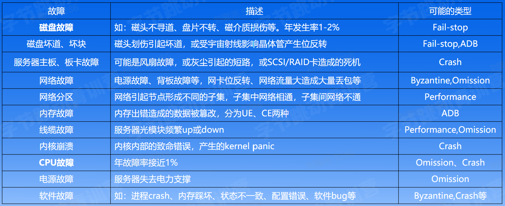
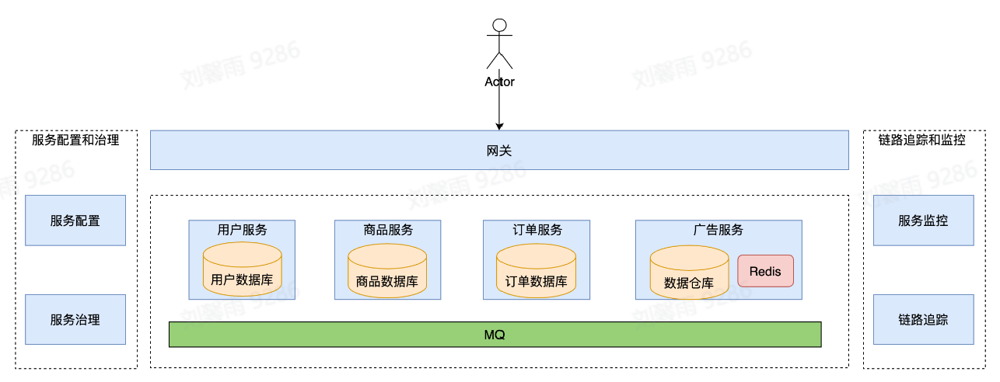

## 字节青训营听课笔记 Part2

### Day1 架构初探 - 谁动了我的蛋糕

#### 什么是架构

**架构演进** 

- 单机架构：所有东西都在一个进程中，放在一个机器上
    - 优点：简单
    - 缺点：需要停服，承载能力有限（C10k问题：单机并发数不超过10000）

- 单体架构：在单机架构的基础上，部署到多台机器上
    - 优点：具备水平扩容能力
    - 缺点：后端进程职责太多，爆炸半径大，一个很小的模块出问题可能导致整个进程崩溃

- 垂直应用架构：将进程按照某种依据拆分为多个进程
    - 优点：一定程度优化了单体架构的缺点
    - 缺点：没有根本解决单体架构的问题

- SOA (面向服务架构)：将进程按照不同功能单元拆分为服务，服务之间通讯
    - 优点：各服务的职责更清晰，运维粒度减小到服务，爆炸半径可控
    - 缺点：ESB (企业服务总线) 往往需要一整套解决方案
> ESB: 它做了消息的转化解释和路由工作，让不同的服务互联互通。所有的服务与ESB通信，让本来杂乱无章的互相通信变得清晰

- 微服务：在SOA上的升华，通过服务实现组件化。原有的单个业务系统会拆分为多个可以独立开发、设计、运行的小应用。去中心化，不需要ESB。
    - 优点：兼具 SOA 解决的问题，服务间的通信更敏捷、灵活
    - 缺点：运维成本

**架构的初衷** 

- 解决需求量增加人手不够的问题
- 服务越做越复杂，需要更好的分工合作

**架构的演进思路** 

- 垂直切分
- 水平切分

#### 企业级后端架构剖析

**云计算**

基础：
- 虚拟化技术：整租 or 合租（机器虚拟成一个 或者 机器虚拟出来很多个虚拟机）
- 编排方案：资源编排负责分配资源/工作负载编排负责在资源之间共享工作负载/服务编排负责将服务部署在服务器或云环境中

架构：
- Iaas (Infrastructure as a service): 云基础设施，对底层硬件资源池的抽象 自己实地去买房子 or 在网上的房屋租赁平台买
- Paas (Platform as a service): 基于资源池抽象，对上层提供的弹性资源平台 类比于 自己装修 or 装修公司装修
- Saas (Software as a service): 基于弹性资源平台构建的云服务 从0培训 or 已经经过培训的师傅 
- Faas (Function as a service): 更轻量级的函数服务 手工制作 or 做蛋糕的机器

**云原生** 

代表技术
- 弹性资源：虚拟化容器，资源扩缩容
- 微服务架构：统一通信标准，业务功能单元解耦
- DevOps：用于开发和运维
- 服务网格：网络代理，微服务之间通讯的中间层，将流量层面的逻辑与业务进程解耦，实现包括服务发现，负载均衡在内的一些功能；与业务进程采取进程间通信的模式，异构系统治理体验的统一化（支持不同语言

#### 企业级后端架构的挑战

**基础设施层面** 

物理资源有限
- 机器
- 带宽

资源利用率受制于部署服务

**用户层面** 

服务通信开销

网络抖动导致运维成本增加

异构环境下，不同实例资源水平不均（可能有些机器老化，有些年轻

**解决**

合并离线资源池和在线资源池，自动扩缩容（依据什么指标），根据需求增涨或减少在线资源

微服务亲和性部署：通信比较多的容器放在同一台主机上

CPU水位负载均衡: 自适应动态权重

### Day2 分布式理论 - 现代架构基石

#### 分布式概述

优点：去中心化、低成本、弹性、资源共享、可靠性高

挑战：故障、网络、环境、安全

**故障模型** 

- 六种故障模型，从处理的难易程度分类
    - Byzantine failure：节点可以任意篡改发送给其他节点的数据，是最难处理的故障
    - Authentication detectable byzantine failure (ADB)：节点可以篡改数据，但不能伪造其他节点的数据
    - Performance failure：节点未在特定时间段内收到数据，即时间太早或太晚
    - Omission failure：节点收到数据的时间无限晚，即收不到数据
    - Crash failure：节点停止响应，持续性的故障
    - Fail-stop failure：错误可检测，是最容易处理的故障

- 故障模型举例，按照模型分类
    - 磁盘、主板、交换机、网络分区、cpu、内存、线缆、电源等故障

 

**拜占庭将军问题** 

两将军问题：理论上永远无法达成一致

三将军问题：如果有一个叛徒，将不会达成一致

四将军问题，增加一个消息分发中枢D，不负责投票，第一轮D收集ABC的决策，将正确的决策交给它们，第二轮去掉D，ABC互通投票；在D为叛徒时，三个将军都是好人，可以达成一致，在D为好人时，好人将军将会得到同样的正确决策，保证第二轮投票一定两票优先

3m+1个将军，m个叛徒，m轮协商，可以达成一致

> 如果a\—>b b\->a 那么ab两个事件是并发的

#### 理论基础

CAP理论：一致性，可用性，分区容错性（三者无法同时达到，但是可以尽量保证

ACID理论：事务的特性，原子性，一致性，隔离性，持久性（AC一定要保证，I和D不一定

BASE理论：基本可用，软状态（允许存在中间状态），最终一致性（在没有别的数据加入后所有副本最终可以达成一致

#### 分布式事务

**二阶段提交**

协调者：负责与参与者通信，获得写入状态，决定回滚或者提交

参与者：参与事务写入的单元

需要注意的问题：
- 性能问题：需要多次网络通信，资源需要等待并锁定
- 协调者单点宕机，需要重起一个协调者，如何确定状态选出新协调者
- 如果commit失败，要对事务进行重做，但是其中某一个commit已经成功了但是又回滚了，就是造成振荡，可能需要锁的保护

**三阶段提交** 

增加了CanCommit阶段，先看看是否能提交，免得白pre了

增加了超时机制，等待超时后，会自动提交

**MVCC** 

维持一个数据的多个时间戳版本

时间戳的获取：有一个API提供物理时钟 或者协调者向中心化节点获取时钟

#### 一致性协议

略

### 微服务框架 - 不变的基建

#### 微服务架构介绍

 

核心要素：
- 服务治理：服务注册、服务发现、负载均衡、扩缩容、流量治理、稳定性治理
- 可观测性：日志采集、日志分析、监控打点、监控大盘、异常报警、链路追踪
- 安全：身份验证、认证授权、访问令牌、审计、传输加密、黑产攻击

#### 微服务架构原理及特征

**基本概念** 

服务：一组具有相同逻辑的运行实体

实例：一个服务中，每个运行实体就是一个实例

集群：服务内部的逻辑划分，包含多个实例

常见的实例承载形式：进程、VM、k8s Pod

有状态/无状态服务：服务的实例是否存储了可持久化的数据

服务间通信：意味着网络传输

**服务注册与发现** 

问题：在代码层面如何指定一个目标服务的地址

- 硬编码：只能访问一个服务器
- DNS：本地DNS缓存，存在时延；负载不均衡，第一个IP会被访问的多；不支持服务实例的探活检查；域名无法配置端口

解决：新增一个统一的服务注册中心，存储服务名到服务实例的映射

实例上线与下线：
- 首先在注册中心删除实例的映射，一段时间后没有请求到达该实例，就可以进行删除了
- 先加入实例，然后进行健康检查，再注册

**流量特征** 

统一网关入口

内网通信多数采用rpc

网状调用链路

#### 核心服务治理功能

**服务发布** 

让一个服务升级运行新的代码的过程

难点：服务不可用、服务抖动、服务回滚（有bug）

解决：
- 蓝绿部署：将流量切到某一个集群，升级另一个
    - 简单稳定，但是需要双倍的资源，也可以在低峰时段进行升级
- 灰度发布：一个一个加新的实例，看是否有问题
    - 遇到问题需要回滚，需要更加强的基础能力

**流量治理** 

基于四个维度
- 地区：API gateway service在不同地区部署不同数量的实例
- 集群：少量请求走测试集群，大量请求走稳定部署的集群
- 实例：新机器处理的流量多于老机器
- 请求：标识请求为内部的测试，部署少量的机器用于测试，内部请求走测试集群

**负载均衡** 

上游服务负责分配请求在每个下游实例上的分布

常见的LB策略：
- Round Robin
- Random
- Ring Hash
- Least Request

**稳定性治理** 

线上服务总是会出问题的，跟代码的正确性无关

网络攻击、流量突增、机房断电、光纤被挖、机器故障、网络故障、机房空调故障

- 限流：限制请求数
- 熔断：服务A请求服务B出现连接失败，服务A会直接拒绝请求，防止A持续向B发送请求，但是A会有时去看看B是否恢复
- 过载保护：如果服务的，比如CPU利用达99%，会直接拒绝一部分流量
- 降级：在高负载时接受重要的流量，拒绝普通流量

#### 服务治理实践 - 重试

**重试的意义** 

本地函数调用没有重试的必要

远程函数调用有重试的意义，避免偶发错误

降低错误率、降低长尾延时、容忍暂时性错误、避开下游故障实例

**重试的难点** 

为什么默认不用

- 保证幂等性
- 重试风暴：由于调用链路的关系，越往后重试的次数越多
- 超时时间设置需要复杂的考虑

**重试策略** 

限制重试比例

防止链路重试：在最后一层服务重试，其他服务返回特殊的状态，表示请求失败但不要重试

Hedged Requests：对于向最下游的服务请求的服务，提前重试缩短长尾请求时延
