## 字节青训营听课笔记 Part3

### Day1 分布式定时任务

#### 前言

任务：春节集卡瓜分20亿

需求：自动化 + 定时执行 + 海量数据 + 高效稳定 = 分布式定时任务

**linux定时任务** 

CronJob命令：简单可靠，但只能控制单台linux机器

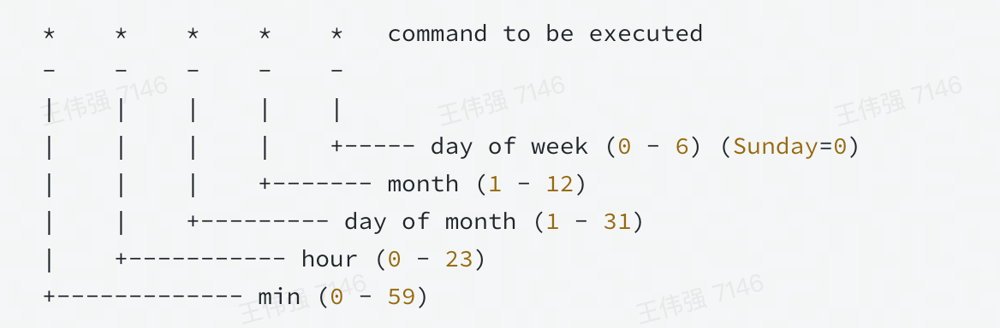 

**单机定时任务** 

用代码实现，可以跨平台，但是还是单机任务

```go
//实现每隔五分钟定时刷新本地缓存数据
func main() {
    ticker := time.NewTicker(5 * time.Minute)
    for {
        select {
            case <- ticker.C:
                syncLocalCache()
        }
    }
}
```

如果要执行多个任务可以用线程池

**任务调度框架 - Quarts**

它实现比较全面地解决定时任务的问题，对单个任务实现了极致的控制，但是没有负载均衡机制，在分布式上做的很差，使用不多

**分布式定时任务** 

平台化管理：用户可以在平台注册自己的任务

分布式部署：突破性能瓶颈

支持海量任务

#### 分布式定时任务

定义：分布式定时任务是把分散的、可靠性差的定时任务纳入统一的**平台**，并实现集群管理调度和**分布式部署**的一种定时任务的管理方式。

执行方式：
- 单机任务：随机触发一个机器执行，适合计算量小、并发度低的任务
- 广播任务：广播到所有的机器执行同一个任务，比如：清理日志
- Map任务：一个任务分出多个子任务，每个子任务负责一部分的计算，适合计算量大，单机无法满足要求的任务
- MapReduce任务：子任务经过计算后需要汇总

春节集卡与执行方式：对集卡的汇总计算用MapReduce，开奖用Map

业内各企业都有自己流行的分布式定时任务框架

分布式定时任务与大数据处理引擎：后者致力于将源数据处理为成果数据，前者在此基础上还可以调用HTTP服务或者RPC服务等去做一些事情，比如后者可以计算哪些用户需要发多少奖，但是前者可以执行发奖这个动作。

#### 实现原理

三个核心问题：触发，调度，执行

核心架构：
- 触发器：解析任务，生成触发事件，在规定时间点触发任务的调度
- 调度器：调度任务，管理任务生命周期
- 执行器：获取执行任务单元，执行任务逻辑
- 控制台：任务管理和干预

数据流：
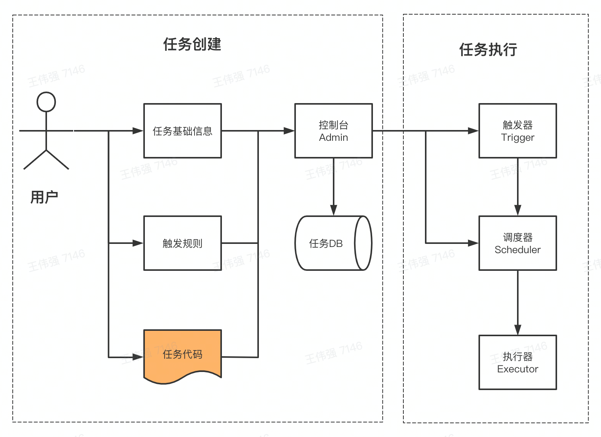 

**控制台** 

基本概念：
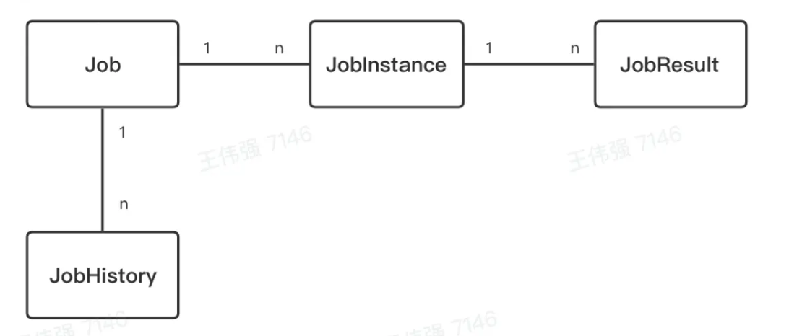 

图中给出的是几个基本概念的对应关系

- Job：任务元数据，记录任务的信息
    - 基础信息：叫什么名，属于哪个业务
    - 调度时机：在什么时候被调度
    - 执行行为：做什么事情
    - 执行方式：上面提到的单机、广播等
- JobInstance：任务实例，每次任务运行时的实例
    - Job_id：与Job关联
    - 触发事件：真正执行的时间
    - 状态和结果
    - 过程信息
- JobResult：任务实例运行的结果，可以是成功、失败或其他等等
- JobHistory：任务元数据可以被修改，修改历史由任务历史存储

**触发器** 

设计约束：
- 支持大量任务
- 支持秒级调度
- 周期任务需要多次执行
- 保证秒级扫描的高性能，避免资源浪费

方案设计：

1. 定期扫描加延时调用
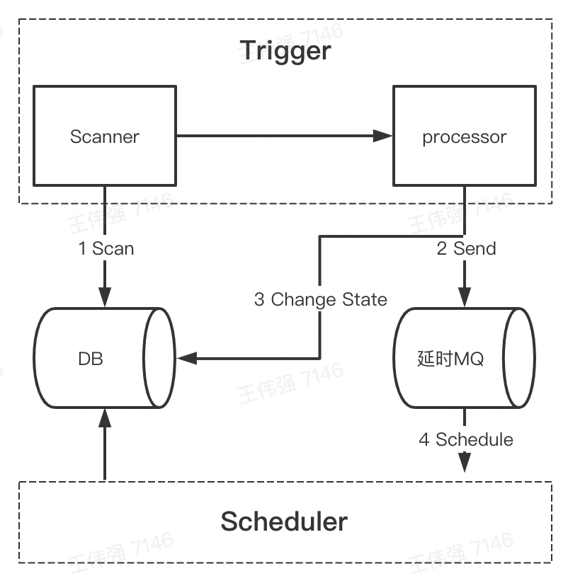 

首先Scanner会扫描DB，找到任务交给processor, processor将定时消息转化为延时并发送消息给延时MQ，到点后交给调度器处理

2. 时间轮

多级时间轮，比如有时、分、秒，指针到时后，变到下一级分，分到后，变到下一级秒，秒到后执行

问题与解决：

1. 不同业务之间，任务的调度互相影响，比如某一个秒级定时任务占用资源太多，挤占其他任务的资源

在存储上，不同国别、不同业务做资源隔离；在运行上，分开执行

2. 单节点机器挂掉了

集群化部署，同时要通过数据库锁或分布式锁保证任务只被触发一次

**调度器** 

1. 资源来源

- 业务系统提供
    - 优点：任务执行和业务系统共用一份资源，资源利用率高
    - 缺点：更容易发生定时任务脚本影响在线服务的事故；不能由平台控制扩缩容

- 定时任务平台
    - 优点：任务执行与业务在线服务解耦，避免相互影响；可以优雅地扩缩容
    - 缺点：消耗更多机器资源；需要额外为定时任务平台申请接口调用权限

2. 资源调度

随机选择节点、广播、分片

- 任务分片

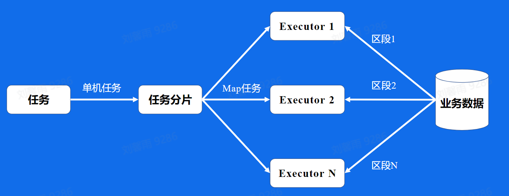 

- 任务编排

有向无环图可视化任务编排（任务之间存在依赖

- 故障转移

在一台机器执行失败后，将任务分配给其他机器

- 高可用

调度器无状态，可以集群部署

3. 任务执行

- 机器注册，将自己注册到调度器
- 调度器向执行器发出调度请求，执行器在自己的JobHandler里进行执行，在这个过程中可能会回传日志或发送回调请求给调度器
- 定时状态上报，心跳检测

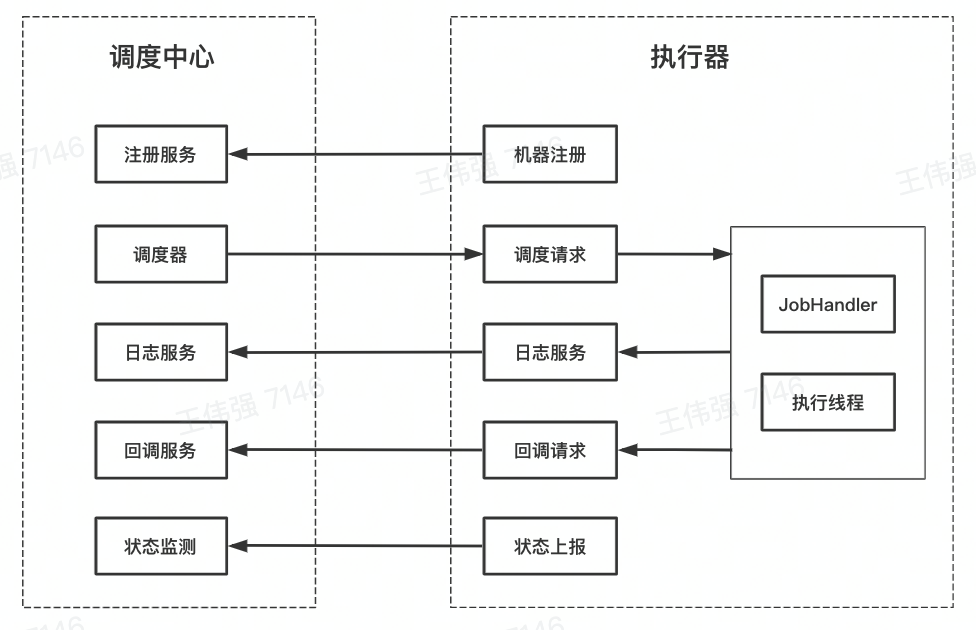 

#### 业务应用
    
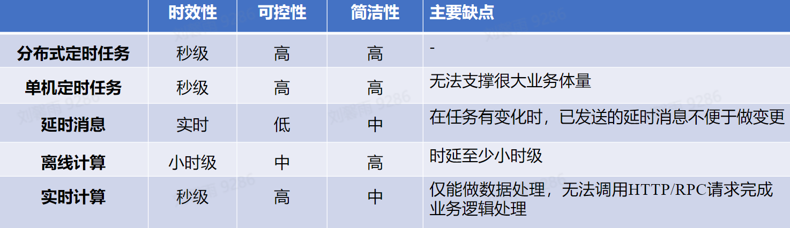 

### 消息队列
    
解决四个场景的问题：
- 系统崩溃（某一步骤，比如记录存储出现了问题导致系统崩溃）
    - 解耦：需要存储的记录首先进入消息队列，然后进入存储服务
- 服务能力有限（订单量庞大，处理能力有限）
    - 削峰：发起订单先进入消息队列，每次根据处理能力取出相应的订单数进行处理
- 链路耗时长尾（最后一步耗时极慢，影响体验）
    - 异步：发起订单给到消息队列后，异步地通知下单成功，增加订单数等
- 日志存储（服务器坏掉造成日志丢失）
    - 日志处理，先进入消息队列，再进行处理

消息队列是什么：保存消息的一个容器，本质上是个队列，但是这个队列**高吞吐、高并发、高可用**

#### kafka

**使用场景** 

日志信息、Metrics数据（实时监控数据）、用户行为（搜索、点赞、评论、收藏）

**如何使用kafka** 

创建集群 -> 新建Topic（设置分区数量） -> 编写生产者逻辑 -> 编写消费者逻辑

基本概念：
- topic：逻辑队列，对于不同的业务场景，创建一个topic
- partition：一个Topic可以有多个不同的分区，分区之间可以并发处理
- cluster：物理集群，可以有多个topic
- producer：将业务消息发送到topic，
- customer：消费topic中的消息
- CostomerGroup：不同组消费者消费进度互不干涉

- offset：消息在partition的相对位置信息，可以理解为唯一ID，严格递增
- replica：每个分片有多个副本，副本有leader，从ISR中选出（ISR为与leader相差不大的副本）

集群会有多个Broker，尽量将副本放在不同的Broker上，集群中有一个Controller，负责分配

zookeeper：存储集群元信息，包括分区分配信息等

**一条消息的视角** 

- 发送一条消息后再等待回复比较缓慢

Batch操作，批量发送很多消息，减少IO次数

- 批量发送，如果消息量太大，网络带宽不够

对消息进行压缩

- 消息发送到Broker后，Broker如何存储数据

在每个副本用日志存储，日志又分为LogSegment，一个Segment包括以下几个文件（文件名为偏移量最小）：.log（真实的日志文件）、.index（偏移量索引文件）、.timeindex（时间戳索引文件）、其他文件

- 磁盘寻道成本较高

顺序写可以提高效率

- 在消费者向Broker请求消息后，Broker如何找到消息

根据offset二分找到目标文件，再在文件中二分找到目标行（Batch行，记录有offset对应的position

如果给的是时间戳，先根据时间戳找到offset，再重复上面的步骤

- 从磁盘读取消息并发送，反复的拷贝消耗时间

采用零拷贝，从磁盘读取消息后，直接往NIC Buffer拷贝，从网卡发出

- 消费者组中，每个消费者消费哪些分区的数据

如果手动分配，有Consumer挂掉了，会导致某些分区的数据没法拷贝，或者增加消费者。

采用自动分配，在Broker中选择一个Coordinator，负责协调，这个过程叫rebalance

- 关于rebalance
    - 首先，Consumer向集群询问哪个Broker是Coordinator
    - 然后，Consumer向协调者发送加入消费者集群的请求
    - 协调者收到请求后会从Consumer Group中选择一个Leader，负责分配（有默认的分配方式，但是也相当于提供一个接口，业务可以根据自己的特性实现分配方式
    - 接着消费者向协调者发送，同步集群分配方案
    - 之后，消费者通过心跳通知协调者自己还活着

**kafka的一些缺点** 

- 数据复制

包括重启、扩缩容等关于节点变动的情况下，需要有一个日志数据的复制，比较耗时

- 负载均衡

如果某一个机器数据过多，可能需要数据的迁移来平衡负载，但是数据迁移又是需要很多IO操作的，需要在这两者之间进行权衡，解决方案复杂

- 其他：运维成本高；没有自己的cache，完全依赖Page Cache，灵活程度不够；Controller和Coordinator在同一个Broker上，如果后者占用资源过多，导致前者性能下降，造成的问题是灾难性的

#### BMQ

兼容kafka协议，存算分离，云原生消息队列

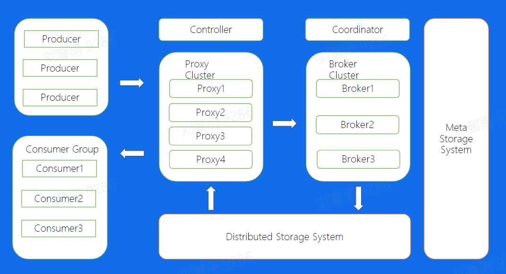 

BMQ可以在秒级完成重启、替换、扩缩容

文件结构：分布式存储系统使用的是HDFS，会将很大的partion分成同样大小，所以不会出现kafka的问题

**Broker** 

Broker Partition 状态机： 

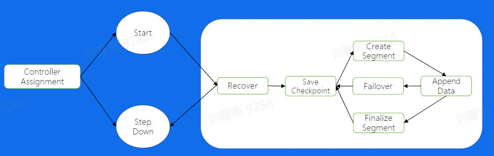 

保证对于任意分片同一时刻只在一个Broker上存活

Recover过程：
- 争夺这个分区写的锁
- 让真实的数据与元数据保持一致

写文件过程：

- 数据校验 -> 写入buf -> 开启Write Thread写入数据库
- 有两种方式，一种是保证高吞吐，在写入buf后就返回成功；另一种保证高可用，在写入数据库后再返回成功
- Write Thread 干些什么
    - 数据写入
    - 根据机制一段时间后进行flush操作
    - 建立索引
    - 建立检查点（如果在flush后机器宕了，重启后检查点和数据比较就可以知道索引是否成功建立）
    - 写新的segment

如果Failover了，重新选择节点再写入

**Proxy** 

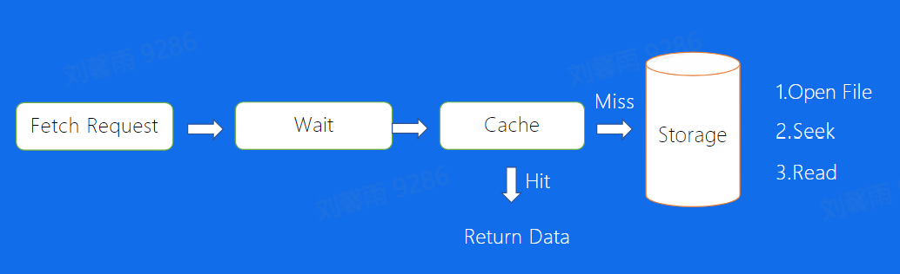 

发送请求后进入Wait阶段，如果一个Topic一直没有数据写入，一般设置两个参数，要有一定量的数据或者到达一定的时间后，Wait返回（使用Wait防止持续的请求

多机房部署：Broker和分布式存储保证副本在不同机房，Proxy会需要访问到多个机房的数据

**高级特性** 

1. 泳道消息

对于一个Topic会产生一个副本，和它的配置一样，前者用于主干，后者用于泳道。在线下测试环境做测试时，将后者分出不同的泳道，对应泳道的生产者生产的消息只会被相应泳道的消费者消费，可以用于多个测试场景并发测试。此外可以在泳道进行PPE（产品预览环境）验证，在主干部署生产环境，实现干泳道流量隔离

2. Databus

为应用配置了一个databus的代理，可以简化消息队列客户端的复杂度，也可以在这里缓存，缓解集群的压力，此外还有一个databus Serve，可以通过它更改一些配置，达到解耦业务和Topic的目的

有消息延时，不适合对消息及时有要求的业务

3. Mirror

使用Mirror通过最终一致的方式实现跨Region的读写问题

消费的可能是30s之前的数据，但是每次消费的时候都可以及时得到消息进行消费

Mirror的作用是将一个region的写入异步地传给其他的region的集群，其他region读入这个写入时感觉就是读取本region的数据一样，代价就是异步的延迟

4. Index

用于用户需要在MQ查询数据

将数据直接在MQ结构化，配置索引，最后通过index query进行查询

5. Parquet

新型列式存储格式

BMQ会在最后将数据列式存储

#### RocketMQ

使用场景：实时业务、秒杀场景

对比kafka，新增了标签，为了处理事务消息增加了消费者组

NameServer为生产者消费者提供路由，知道应该从哪个broker获取消息

它的master、slave的概念是针对整个机器的

所有的生产者都将消息发送到CommitLog，在实际的ConsumerQueue中存储的是消息的密集索引

高级特性：

1. 事务场景

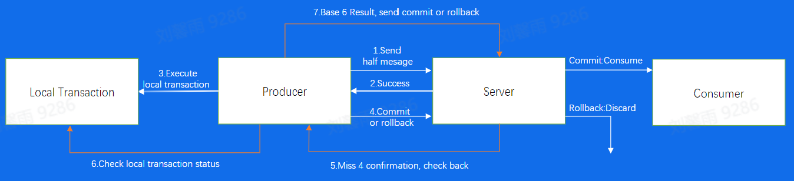 

在传递消息的时候将要保证原子性的操作一起放在事务里

2. 延时发送

引入延迟消息处理的调度，第一次进入消息队列会交给延时服务，第二次才正常消费

3. 消息重试和死信队列

设置重试次数，超过的发到死信队列，不会处理，但是可以对其进行分析；如果没超过，scheduleTopic等待延期重试

### RPC 原理与实践

#### 基本概念

远程函数调用，需要解决的问题：
- 函数映射
- 数据转换成字节流
- 网络传输

IDL文件：描述接口的语言，使得不同平台上运行的对象和用不同语言编写的程序之间可以互相通信

生成代码：使用编译工具可以把IDL文件转换为语言对应的静态库

编码和解码：即将数据转化为字节序列，成为序列化和反序列化

通信协议：数据在网络中传输的内容和格式

网络传输：通常基于TCP和UDP进行传输

RPC好处：
- 单一职责，有利于分工协作和运维开发
- 可扩展性强，资源使用率更优
- 故障隔离，服务的整体可靠性更高

RPC带来的问题：
- 服务宕机，客户端如何处理
- 网络异常，如何保证消息的可达
- 请求量突增导致服务无法及时处理

这些问题将由RPC框架处理

#### 分层设计

**编解码层** 

二进制编码 - TLV编码
- Tag: 标签，可以理解为类型
- Length: 长度，如果长度是固定的，就不用了
- Value: 值，也可以是TLV结构

编码选型：
- 兼容性：新增字段不影响老的服务
- 通用性：支持跨平台，跨语言
- 性能：从时空两个角度考虑

**协议层** 

协议有两种
- 特殊结束符标志内容结束
- 变长协议：指定消息体长度

协议格式略

协议解析：首先获取magic number知道是什么协议，然后知道它的编码方式，最后对消息体进行解码

**网络通信层** 

Sockets API

一般使用网络库：
- 底层封装了Sockets API，并提供简单易用的API
- 支持不同的协议，可以优雅退出，异常处理
- 在性能上会采用应用层buffer减少拷贝，高性能定时器，对象池

#### 关键指标

**稳定性** 

保障策略：
- 熔断：可能出现服务A调用服务B，服务B调用服务C，服务C响应慢导致服务B返回给A超时，然后服务B中堆积服务A的请求而可能导致宕机。所以在某个服务的调用失败率达到一定阈值后熔断器会停止对该服务的继续调用，保护调用方。
- 限流：保护被调用方，防止大流量压垮服务
- 超时控制：避免浪费资源在不可用节点上

请求成功率：
- 负载均衡
- 重试

长尾请求：
- Backup Request：以响应时间排序的99%作为一个超时时间，超过那个时间重新发送，避免长尾请求返回慢造成的延迟很大

通过注册中间件的方式加入保障策略

**易用性** 

合理的默认配置、丰富的文档

生成代码工具，脚手架工具

**扩展性** 

中间件、可选项、代码生成工具插件支持

**观测性** 

Log（日志）、Metric（监控）、Tracing（追踪）

内置观测服务

**高性能** 

连接池、多路复用、高性能编解码协议、高性能网络库

#### 企业实践

自研库背景：
- 原生库go-net无法感知连接状态，使用连接池时，池中存在失效连接
- 原声库存在goroutine暴涨的风险，一个连接一个goroutine的模式，连接利用率低下，大量goroutine占用调度开销，影响性能

自研网络库 - Netpoll
- 引入epoll主动监听机制，感知连接状态
- 建立goroutine池，复用goroutine
- 提升性能，引入NoCopy Buffer，向上层提供NoCopy的调用接口

kitex扩展性设计
- 支持多协议，也支持灵活的自定义扩展

kitex性能优化
- 网络库优化
    - 调度优化
    - LinkBuffer
    - Pool：引入内存池、对象池
- 编解码优化
    - 在代码生成上
        - 预计算预分配内存
        - inline
        - 自研thrift解析和生成go代码
    - JIT
        - 即时编译减轻维护生成代码的负担
        - 自研了基于JIT编译技术的高性能动态Thrift编解码器
- 合并部署
    - 将亲和性强的服务调度到同一个物理机，远程调用优化为本地调用
    - 基于这一点的定制化设计

