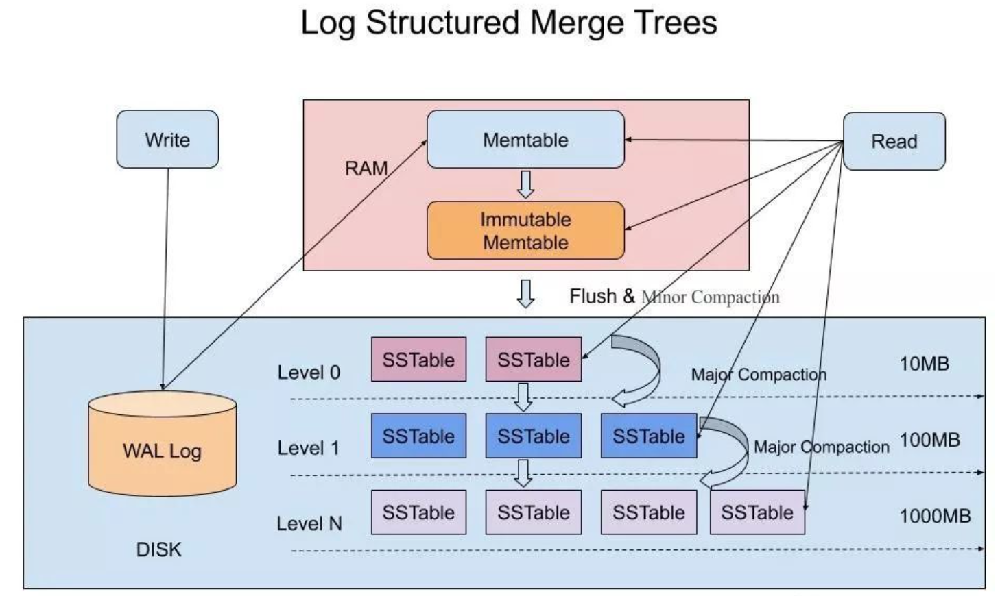
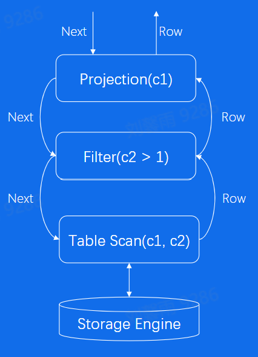
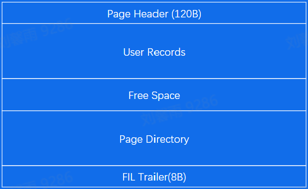
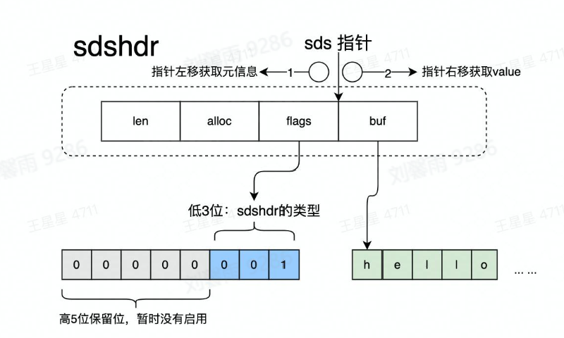
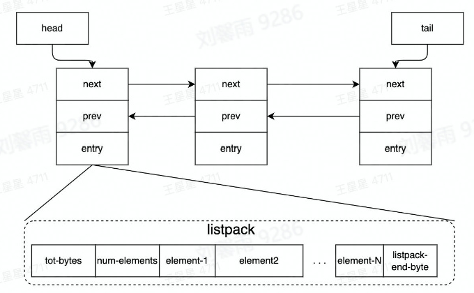
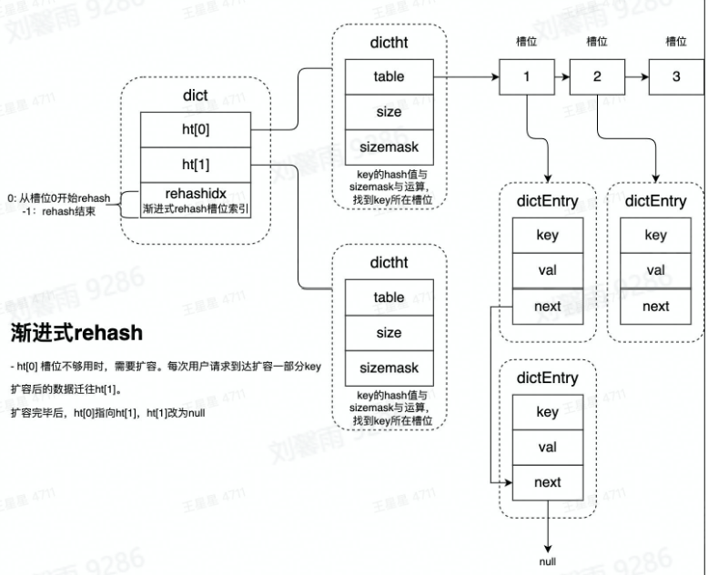
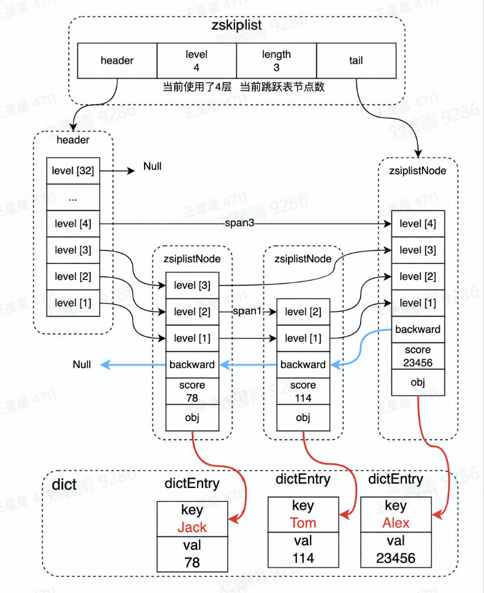
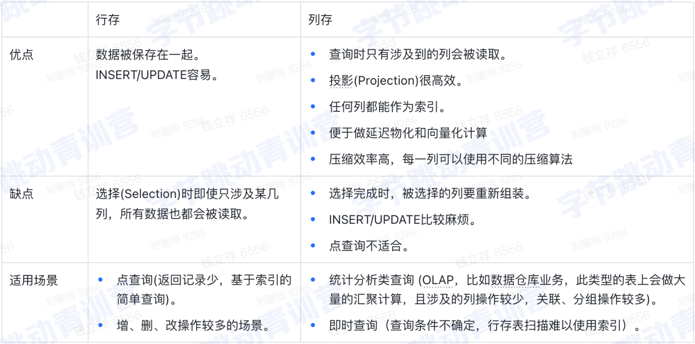

## 字节青训营听课笔记 Part4

### Day1 带你认识存储的本质 - 状态

#### 经典案例 - 数据的持久化

校验数据的合法性 -> 修改内存（用高效的数据结构存储数据）-> 写入存储介质

#### 存储和数据库简介

**存储系统**

- 用户：提供读写、控制类接口
- 介质：安全有效将数据持久化
- 内存：内存数据结构，达到较好的性能
- 网络：单机系统发展为分布式系统

系统特点：
- 性能敏感，要求高，因为操作多，需要有较好的性能
- 代码既简单又复杂，前者是性能要求，后者是要考虑异常情况
- 架构容易受硬件影响

数据应用到存储介质需要注意的点：
- 缓存很重要，可以提升性能
- 拷贝是非常昂贵的，应该尽量减少
- 硬件设备五花八门，需要有统一的抽象的接入层

RAID技术：
- RAID 0：多块磁盘简单组合，数据条带化存储，提高磁盘带宽（并发），无容错
- RAID 1：一块磁盘对应额外一块镜像盘
- RAID 0+1：先进行并发，再将组合起来的对应镜像，占用率还是50%

**数据库** 

数据库是存储系统，但是在存储之外，又展现出其他能力

数据库与经典存储 - 结构化数据存储
- 关系型数据库：以表的形式存储
- 经典存储：比如一个json，它首先要给出整个json的长度，然后是json第一个元素的长度，接着是元素的值，等等

数据库与经典存储 - 事务能力ACID

数据库与经典存储 - 复杂查询能力

#### 主流产品剖析

**单机存储** 

本地文件系统：
- 文件系统的管理单元：文件
- 文件系统接口：文件系统种类繁多，但是都遵循VFS的统一抽象接口
- Linux文件系统两大数据结构
    - Index Node：记录文件元数据，inode为文件唯一标识
    - Directory Entry：记录文件名，inode指针，层级关系等，与inode的关系是N：1

Key-Value存储：
- 常见使用方式：put、get
- 常见数据结构：LSM-Tree （某种程度上牺牲读性能，追求写性能）
    - 磁盘的批量顺序写，比随机写性能高出许多
- RocksDB

> LSM_Tree简介:
>
>  
>
> WAL Log 是一个预先写的日志，写操作会首先将数据记录再WAL Log中用于故障恢复。然后会将内容写入内存中的Memtable中，它的结构是一个红黑树之类的数据结构，能够保证数据在这里面是有序的，当里面的数据达到一定的程度，它会变成一个Immutable Memtable而不可修改，并且出现一个新的Memtable用于写。Immutable Memtable 会被刷到内存中，它会被刷成一个SSTable（其实它自身也是一个SSTable），每个SSTable的数据一定是有序的，由前面的数据结构决定了。刷入内存会首先进入Level0，这一层没有进行合并，所以可能有重复的key，它不断接受来自内存的SSTable，等到Level0到达一定的规模，或者为了错峰防止合并占用CPU，选择低峰时段，进行合并操作，用归并排序进行多版本合并，合并到更高层级。
>
> 在SSTable的末尾会存有稀疏索引，存在部分键和它的偏移，于是可以先二分找到一个范围再进行搜索。对于不存在的数据，引入布隆过滤器，该过滤器判断某值不存在，则它一定不存在。
>
> 此外，为了优化读取，还可以采用分组压缩，缓存Scan的Block等进行优化

**分布式存储** 

HDFS是弱POSIX语义

> POSIX: 可移植操作系统接口。API可以在各种不同的操作系统上实现，给应用程序提供完全相同的接口，而它们本身在这些系统上的实现却可能迥异。POSIX是由IEEE的一组标准组成，其目标是提供一套大体上基于Unix的可移植操作系统标准。

Ceph（具体的实现细节要去看论文）
- 特点：
    - 高性能：Crush算法、容灾域的隔离、存储节点的规模大
    - 高可用：副本数灵活控制、强一致等
    - 高扩展
    - 支持三种存储接口并且可以自定义接口：对象存储、块存储、文件存储
- 核心组件：
    - Monitor：一个Ceph集群需要多个Monitor组成的小集群，它们通过Paxos同步数据，用来保存OSD的元数据。
    - OSD：存储节点，它可以仅由很普通的组件来构成，只需要包含CPU、网卡、本地缓存和一个磁盘或者RAID，并将传统的块存储方式替换成面向对象的存储。
    - RADOS：一个可用于PB级规模数据存储集群的可伸缩的、可靠的对象存储服务。
    - Object：RADOS的基本存储单元。
    - PG：对object的存储进行组织和位置映射。一个PG负责组织若干Objects，然后映射到多个OSD中，冗余存储，一个OSD中包含多个PGs
- 集群维护：
    - 由若干个monitor共同负责整个RADOS集群中所有OSD状态的发现与记录，并且共同形成cluster map的master版本，然后扩散至全体OSD以及client。OSD使用cluster map进行数据的维护，而client使用cluster map进行数据的寻址。
    - cluster map 的更新为异步和lazy扩散
    - 具体的OSD加入或者退出等细节看论文
- Ceph IO流程及数据分布（略
- 心跳机制（略
- Ceph通信框架（略

[一份详细的Ceph介绍](https://cloud.tencent.com/developer/news/275070) 

> 比较对象存储、文件存储和块存储:
> 
> 文件存储使用分层存储结构，文件被命名，以元数据标记，然后放入文件夹中。要找到某个数据，您需要知道查找该数据的正确路径。常用于存储共享文件和文档，因为文件系统提供了共享和访问控制功能。
> 
> 块存储系统会为每个原始数据块分配一个唯一标识符，当您需要访问完整的文件时，系统将使用唯一标识符将数据块重组为完整的文件。块存储非常适合需要处理大量事务型数据或使用任务关键型应用的组织，可提供低延迟和一致的性能。但是，块存储费用高昂，不提供元数据功能，并且需要操作系统才能访问块。块存储通常用于存储数据量较小但访问速度要求较高的数据，例如虚拟机镜像。
>
> 对象存储将文件存储为扁平数据环境（即存储池）中的独立对象，对象包含全部数据、唯一标识符和详细元数据（元数据包含关于数据、权限、政策和其他应急情况的信息）。对象存储最适合非结构化数据的静态存储，您只写入一次数据，但可能需要多次读取。常用于存储海量的非结构化数据。

**单机数据库** 

- 关系型数据库

产品：商业数据库Oracle，开源数据库MySQL & PostgreSQL

通用组件：
- Query Engine：解析query，生成查询计划
- Txn Manager：负责事务并发管理
- Lock Manager：负责锁相关策略
- Storage Engine：负责组织内存、磁盘数据结构
- Replication：负责主备份同步

关键内存数据结构：BTree、B+Tree、LRU List
关键磁盘数据结构：RedoLog、Page

- 非关系型数据库

产品：MongoDB、Redis、Elasticsearch

特点：
- 关系型数据库一般采用SQL交互，但是非关系型数据库交互方式各不相同
- 数据结构千奇百怪
- 尝试支持SQL和事务

**分布式数据库** 

解决容量、弹性（扩缩容）、性价比问题

新的问题：单写->多写  磁盘弹性->内存池化  分布式事务优化

#### 新技术演进

ByPass OS Kernel操作系统内核旁路

SPDK：
- 直接从用户态访问磁盘
- 用轮询代替中断
- 无锁数据结构

AI决策行列混合存储

高性能硬件

### Day2 MySQL - 深入理解 RDBMS

#### 关键技术 

**Parser解析器**

**Optimizer优化器**
- 基于规则的优化
    - 条件化简
    - 表连接优化
    - Scan优化
        - 唯一索引
        - 普通索引
        - 全表扫描
- 基于代价的优化
    - 时间
    - 资源

**Executor执行器**

- 火山模型

    -  

    - 每一层是一个算子Operator
    - 优点：每个算子独立抽象实现，没有耦合，逻辑结构简单
    - 缺点：计算一条数据有多个函数调用开销，导致CPU效率不高

- 向量化
    - 将上图的Row变为Batch，一次返回多条数据
    - 优点：减少函数调用，可以利用CPU cache，还可以利用CPU提供的SIMD机制

- 编译执行
    - 将所有的算子放在一层执行
    - LLVM动态编译技术

**存储引擎 - 以InnoDB为例**

- In-Memory
    - Buffer Pool
        - 每个页面是16K的大小
        - 每个chunck下有多个页面（128M），以chunck为单位申请内存（jemalloc内存分配器概念，为了更好地管理和分配内存）
        - 8个chunck分为一个instance
        - 有一个hash桶将pageid映射到block
        - 有用到LRU算法处理
    - Change Buffer
    - Adaptive Hash Index
    - Log Buffer
- On-Disk
    - System Tablespace（存储表的元数据，权限等）
    - General Tablespaces（存储表数据）
    - Undo Tablespaces
    - Temple Tablespaces（临时数据）
    - Redo Log

页面的组成：
- 头部：包含页面的一些信息
- 记录：每行的记录
- Page Directory：稀疏表存储记录的位置

 

B+树索引：页的查找，从根到叶，叶子通过双指针连接便于范围查找

**事务引擎** 

- 原子性：Undo Log
- 隔离性：锁和MVCC（为每个事务提供读取版本，提高并发度）
- 持久性：Redo Log

#### 企业实践

**大流量** 

- sharding（分片）

增加数据库节点，用户与代理交流

**流量突增** 

- 扩容
- 代理连接池
    - 建立连接池使业务侧或代理侧提前与DB连接
    - 防止突增建立连接导致DB宕机

**稳定性** 

- 3AZ，在三个不同的区域建立机房（保证可用性）
- HA管理，服务监管，切换宕机节点

### Day3 Redis - 大厂程序员是怎么用的

#### 什么是redis

Redis是一个基于内存的开源键值存储系统，可以作为数据库、缓存、消息队列等多种用途。

**Redis工作原理** 

持久化：
- RESP（Redis Serialization Protocol）是Redis使用的一种简单、高效、可扩展的协议，用于客户端和服务器之间的通信。
- 写命令会追加到硬盘的AOF文件
- 全量数据保存在RDB文件中
- 单线程处理所有操作命令

> 将操作先写入到输出缓冲区，并异步地将缓冲区的数据写入到磁盘中，可以提高Redis的写入性能。这是因为Redis可以将多个写入操作合并在一起，减少磁盘I/O的次数，从而提高写入的效率。

#### redis应用案例

**连续签到** 

go语言中的init函数在main函数之前执行，按照包引入的顺序或者定义的顺序进行init

redis的Incr操作可以操作本来不存在数据库中的key

redis的ExpireAt可以设置数据的过期是时间

另外，在redis中，string的存储方式与读取如图所示

 

**消息通知** 

用list作为消息队列

list的数据结构：
- quick_list: 一个节点包含多个元素，双向指针

 

**计数**

pipline的使用，可以一次存储多条数据，增加性能

hash的数据结构如图所示，通过hash将key映射到对应的槽位，槽位上的数据链式存储，当槽位数目不够时，将进行rehash，如果数据量不大，直接复制，如果数据量很大，为了防止阻塞用户请求，将会在用户每次请求的时候复制一部分，渐进式复制直到全部迁移

 

**排行榜** 

zset的数据结构如图所示，采用的是跳跃表加哈希表，前者实现的是排序，后者实现的是按key查找

 

**限流** 

**分布式锁** 

不可以作为高可用的分布式锁使用

该实现存在的问题:
1. 业务超时解锁，导致并发问题。业务执行时间超过锁超时时间
2. redis主备切换临界点问题。主备切换后，A持有的锁还未同步到新的主节点时，B可在新主节点获取锁，导致并发问题。
3. redis集群脑裂，导致出现多个主节点

#### redis使用注意事项

**大Key、热Key** 

大Key的定义：一般string类型value字节数大于10KB或者复杂数据结构元素大于5000或者元素总字节数大于10MB

大Key的危害：
- 读取成本高
- 容易导致慢查询
- 主从复制异常，服务阻塞，无法正常响应请求

业务侧表现：Redis超时报错

消除大Key的方法：
- 一个大key拆分为多个小key（第一key正常读取，value先给出key的个数，方便后面查找第二个key）
- 用压缩算法去压缩value，要平衡压缩和解压的时间

消除集合类复杂数据结构大Key的方法：
- 拆分，用hash算法拆分到不同的key中
- 冷热分离：比如榜单的前十存在zset，其他的存在db里面

热Key的定义：没有明确定义，只经常被访问的数据，如果某个数据存在某个redis中，它经常被访问，每次访问别的redis都要先获得这个数据才能进行后续操作，就会导致它所在的redis负载很高

解决方法：
- 设置localCache，在业务服务侧设置localcache（在内存），这里面的数据过期或者未命中，再访问redis
    - 使用redis代理承载热Key，避免每个业务都要写一个localcache
- 拆分：将热key复制多份，缺点是更新的时候存在短暂的数据不一致

**慢查询场景** 

1. 批量操作一次性传入太多key，建议单批次不要超过100
2. zset不要超过5k
3. 大key的操作与删除

**缓存穿透和缓存雪崩** 

- 缓存穿透：热点数据绕过缓存，直接查询数据库
- 缓存雪崩：大量缓存同时过期

缓存穿透的危害：
- 查询一个一定不存在的数据，被恶意多次请求导致db宕机
    - 解决：缓存空值，对于不存在的数据也进行缓存；布隆过滤器
- 高并发场景下，一个热Key过期，会有大量请求落在db

避免缓存雪崩：
- 将缓存失效时间分散开
- 使用缓存集群，避免单机宕机

### ClickHouse - 你没有见过的列存储

#### 数据库知识补充

数据库可以分为两种类型
- OLTP数据库：专为多个用户执行大量事务而设计
- OLAP数据库：同时分析多个数据维度，更好地理解数据中的复杂关系
    - 大量数据读写，存储PB级别
    - 多维分析，复杂的聚合函数如count、max
    - 窗口函数，自定义的UDF
    - 离线分析和实时分析

**列式存储** 

列式存储的优点：
- 数据压缩
    - 读的数据更少，在IO密集型计算中获得更高的性能
    - 相同类型的压缩效率更高
    - 排序之后压缩效率更高
    - 可以针对不同的类型使用不同的压缩算法
- 数据选择
    - 可以选择特定的列做计算而不是读所有的列
    - 对于聚合计算比较友好
- 延迟物化
    - 物化：将数据转化为可以被计算或者输出的结果的过程，物化后的数据通常可以用来做数据过滤，聚合计算，join
    - 延迟物化，将列数据延迟到需要被使用的时候再进行解压
    - 缓存友好
    - CPU/内存带宽友好
    - 可以利用到执行计划和算子的优化，比如不要在每一次过滤条件都过滤一次，直接在最后过滤一次
    - 有些计算可以直接在压缩列上做计算
- 向量化
    - 用SIMD指令完成的代码设计和执行的逻辑就叫做向量化
    - SIMD指令指某些提供了比如512字节的寄存器的指令集，一条指令就可以进行多个计算
    - 使用SIMD需要明确数据类型，也需要数据存储在连续内存
    - 执行模型要求：数据需要按批读取，因而连续存储效率最好，函数调用也有明确类型要求
    - 列存数据库适合这样的要求

 

#### ClickHouse 存储设计

**表的定义和结构** 

分布式表：不存储数据，用于将查询路由到集群的各个节点
- cluster：逻辑集群，由多个节点组成
- shard-key：指导数据写入分布式表时的分布方式

本地表：实际存储数据的表

每个Shard存储有实际的表，它可以备份并实现主备同步，也可以横向扩容分布式查询

**存储架构** 

文件组织：

- data目录
    - 保存元信息
    - 保存日志
    - 保存数据
        - 库名（database）
            - 表名(table)
                - part
                    - column.bin（存数据
                    - column.mrk（存索引
                    - column.bin...
                    - column.mrk...
                - part...
            - table...
        - database...

part是物理文件夹，partition是逻辑结构，partition包含多个part

一个part有一个主键索引，每个列都有列索引

**索引设计** 

Hash Index: 适用于等值查询

BTree

B+Tree：所有数据存在叶子节点，非叶子节点只保留key值，叶子节点双向连接

B/B+Tree存在的问题：
- 对于大数据量，深度太深
- 索引数据量太大，多个列如何平衡查询与存储
- OLAP场景写入量非常大，如何优化写入

在clickhouse使用LSM-Tree：
- 数据会被分为granules，是数据的最小读取单元，不同的granules可以并行读取（8192行）
- 每个granules对应primary.idx里的一行，一行对应一个mark行，行号一次递增（选择最小的值，不过最后一个mark放最大值），primary.idx会预先加载到内存
- 每一个列都有一个mark文件，每一个mark行存储有压缩后的在磁盘的存储偏移和解压后的数据在内存的偏移

缺陷：
- 对于primary key有多个的查询，只有第一个key过滤效果好，后面的key的过滤效果依赖第一个key的基数大小

解决：
- 建立一个min-max的二级索引
- 建立布隆过滤器
- 构建多个主键索引（将不同的列放在第一位
    - 新建表
    - 建立物化视图
    - Projection（查询自动路由到最优的表，这个表是隐式的，不能被查询）

**数据合并** 

一个part内的数据是有序的，合并不同的part得到新的part

part的格式为：partitionId_起始partid_终止partid_merge的次数

合并过程中未被合并的可见

合并结束后标记被合并的不可见

等待对某个part的查询结束后释放该part

#### ClickHouse应用场景

**大宽表存储和查询** 

动态表结构，map类型中的每个key都是一列，可以进行单独的查询，使用方式同普通列一样

**离线数据分析** 

数据导入

方法一：
- 通过spark生成clickhouse格式的文件
- 导入到hdfs上用hive2ch导入工具完成导入
- 数据直接导入到各物理节点

方法二：按列导入
- 保证查询可以及时访问已有的数据
- 可以按需加载需要的列
- 我的理解是第一个主键首先写入到不同的part，然后将要存入的列和主键比较知道它对应的行是否在本part，匹配到的在本分区，否则在其他的分区继续匹配

**实时数据分析** 

利用消息队列，在clickhouse里部署消费者，消费者将数据转化为合适的形式存储在内存的memory table，到达一定的量后将它写入一个part

**其他场景** 

array column，即本列存储的是数组
- 构建 bitmap-index，记录数组的值在哪些列存在

同样的可以对某一列的值作为键，将另一列的值比如uid的值进行压缩，即键的值对应有哪些uid，用bitmap进行压缩

lowcardinality：
- 对于低基数列使用字典编码（意思是这个列的数据种类不多）
- 存储一个字典，代表这一列有的值，同时根据排列顺序用索引替代了整个字符串值
- 所以对列的真实存储为索引值
- 同时存有一个字典的倒排索引，即根据字典序存储，字符串为键，在前面那个字典中的索引为值，方便根据键快速查找索引
- 插入是必须顺次的，因为变更索引的代价很大

